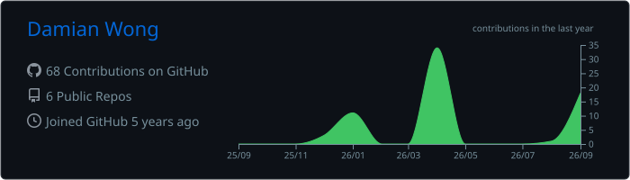

<h1>Damian Wong</h1>

**Connect**

 

 

## Featured Projects

  
  
   
  

## Technologies I Use

  

## GitHub Overview

  

## Contributions

  <picture>
    <source
      media="(prefers-color-scheme: dark)"
      srcset="https://raw.githubusercontent.com/TorpedoD/TorpedoD/output/github-contribution-grid-snake-dark.svg"
    />
    <source
      media="(prefers-color-scheme: light)"
      srcset="https://raw.githubusercontent.com/TorpedoD/TorpedoD/output/github-contribution-grid-snake.svg"
    />
    
  </picture>

